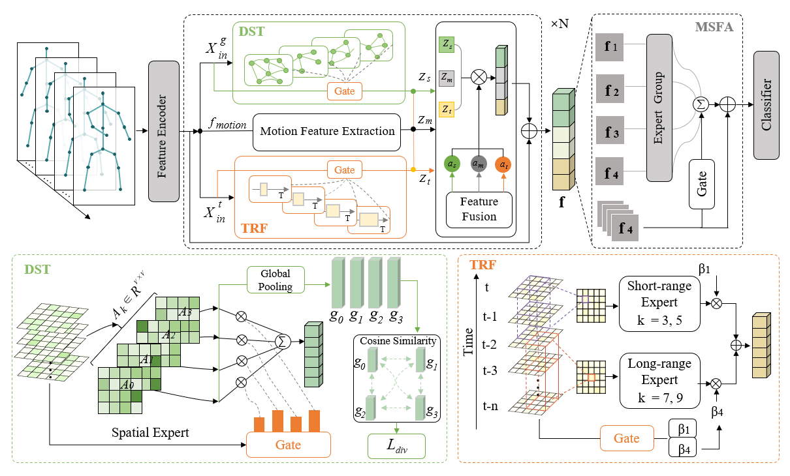

<h1 align="center">
Spatiotemporal Aggregation Experts with Spatial-Specific Constraints for Skeleton-Based Micro-Action Recognition
</h1>

<p align="center">
<strong>
Beike Zhu<sup>1</sup>, Jiacheng Lin<sup>1</sup>, Chengcheng Zhu<sup>1</sup>,
Zhidong Su<sup>2</sup>, Trandinh Phung<sup>3</sup>, Ling He<sup>1</sup>,
Yao Hu<sup>1</sup>, and Guanci Yang<sup>1,*</sup>
</strong>
</p>

<p align="center">
<sup>1</sup> Key Laboratory of Advanced Manufacturing Technology of the Ministry of Education, Guizhou University, Guiyang, China<br>
<sup>2</sup> School of Engineering, Colorado State University Pueblo, Pueblo, USA<br>
<sup>3</sup> Department of Mechanical Engineering, Vietnam-Hungary Industrial University, Hanoi, Vietnam
</p>
<p align="center">
<sup>*</sup> Corresponding author: gcyang@gzu.edu.cn
</p>

<p align="center">
<strong>Official project page for SAE-SC.</strong>
</p>


## Overview

Micro-action recognition (MAR) aims to identify micro-action categories by extracting discriminative cues from subtle, short-duration, and localized variations in human motion. However, existing MAR methods remain limited in modeling fine-grained spatiotemporal discriminative cues and aggregating cross-scale spatiotemporal features.

To address these limitations, we propose **Spatiotemporal Aggregation Experts with Spatial-Specific Constraints (SAE-SC)**, a skeleton-based micro-action recognition method that enhances the modeling and aggregation of fine-grained spatiotemporal cues.


## Method

SAE-SC consists of three main modules:

- **Differentiated Spatial Topology Fusion (DST):** models differentiated topological relations among skeletal joints and adaptively evaluates their discriminative contributions.

- **Multi-Scale Temporal Receptive Field Fusion (TRF):** captures complementary short-term and long-term temporal dynamics through temporal experts with different receptive fields.

- **Multi-Scale Spatiotemporal Feature Aggregation (MSFA):** adaptively aggregates and corrects multi-level spatiotemporal features to emphasize informative responses across different temporal granularities.

  

## Framework

<p align="center">
  
</p>

<p align="center">
  <strong>Overview of the proposed SAE-SC framework.</strong>
</p>


## Installation

Clone the repository and create a conda environment:

```bash
git clone https://github.com/BKZhu-Lab/SAE-SC.git
cd SAE-SC

conda create -n SAE_SC python=3.12 -y
conda activate SAE_SC
```

Install PyTorch with CUDA support by following the
[official installation instructions](https://pytorch.org/get-started/locally/).

Then install the remaining dependencies and local packages from the repository root:

```bash
pip install numpy PyYAML tqdm scikit-learn tensorboardX timm chardet h5py
pip install -e ./torchlight
pip install -e ./torchpack
```


## Data Preparation

SAE-SC is evaluated on MA-52 and iMiGUE using preprocessed skeleton data in Pickle (`.pkl`) format.

For the preprocessed skeleton data released by MMN, please refer to the [MMN dataset repository](https://huggingface.co/datasets/Geo2425/MMN). Follow the access requirements and terms specified by the data provider.

Place the data under the repository root with the following structure:

```text
data/
  MA52/
    train_data.pkl
    train_label.pkl
    val_data.pkl
    val_label.pkl
    test_data.pkl
    test_label.pkl
  iMiGUE/
    train_data.pkl
    train_label.pkl
    val_data.pkl
    val_label.pkl
    test_data.pkl
    test_label.pkl
```

## Training and Testing

Run all commands from the repository root. J and B denote the joint and bone streams, respectively.

### Training

MA-52:

```bash
python main.py --config ./config/train/MA52_J.yaml
python main.py --config ./config/train/MA52_B.yaml
```

iMiGUE:

```bash
python main.py --config ./config/train/iMiGUE_J.yaml
python main.py --config ./config/train/iMiGUE_B.yaml
```

### Testing

Replace each example checkpoint path below with the actual SAE-SC checkpoint for the corresponding dataset and stream.

MA-52:

```bash
python test.py --config ./config/test/MA52_J.yaml --weights ./path/to/MA52_J.pt
python test.py --config ./config/test/MA52_B.yaml --weights ./path/to/MA52_B.pt
```

iMiGUE:

```bash
python test.py --config ./config/test/iMiGUE_J.yaml --weights ./path/to/iMiGUE_J.pt
python test.py --config ./config/test/iMiGUE_B.yaml --weights ./path/to/iMiGUE_B.pt
```

### Two-Stream Fusion

After generating predictions for both streams, run the following commands to obtain the fused predictions.

MA-52:

```bash
python test.py --merge ./work_dir/test/MA52_J ./work_dir/test/MA52_B --work-dir ./work_dir/test/MA52_2s
```

iMiGUE:

```bash
python test.py --merge ./work_dir/test/iMiGUE_J ./work_dir/test/iMiGUE_B --work-dir ./work_dir/test/iMiGUE_2s
```

## Evaluation

By default, single-stream testing saves the following files in the configured `work_dir`:

- `prediction.json`: raw classification logits.
- `prediction.csv`: top-5 predictions.
- `prediction.zip`: a ZIP archive containing `prediction.csv`.

Two-stream fusion averages the joint and bone logits with equal weights and saves the fused `prediction.csv` and `prediction.zip` in the directory specified by `--work-dir`.

For evaluation instructions and related resources, please refer to:

- **MA-52:** The [Codabench evaluation page](https://www.codabench.org/competitions/9066/) provides test-set submission and evaluation instructions.
- **iMiGUE:** The [MiGA 2025 Challenge website](https://cv-ac.github.io/MiGA2025/) provides benchmark information, evaluation protocols, and related resources.

Please check the respective websites for submission availability and required file formats.

## Acknowledgement

We thank the authors of [Motion Matters: Motion-guided Modulation Network for Skeleton-based Micro-Action Recognition](https://github.com/momiji-bit/MMN) for making their code publicly available. Their implementation provided a valuable reference for this project.


## Contact

For questions regarding this work, please contact:

**Beike Zhu**  
Key Laboratory of Advanced Manufacturing Technology of the Ministry of Education  
Guizhou University  
Email: [gs.bkzhu24@gzu.edu.cn](mailto:gs.bkzhu24@gzu.edu.cn)
